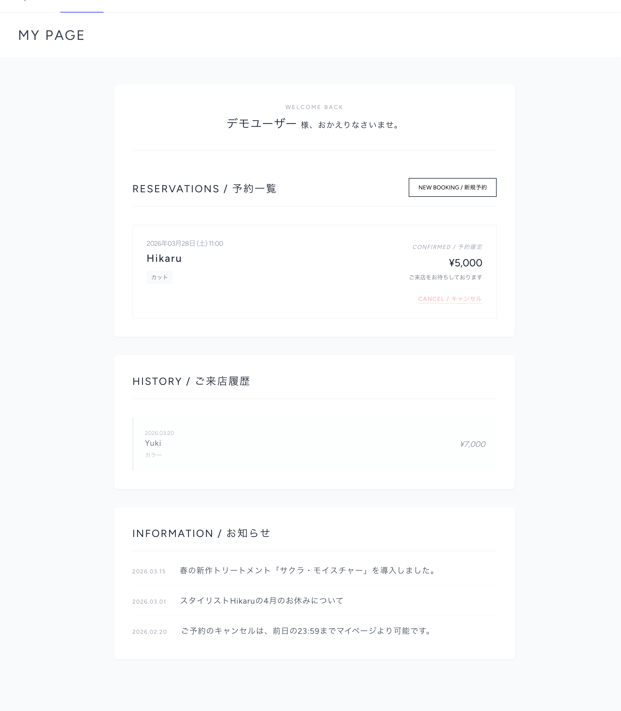
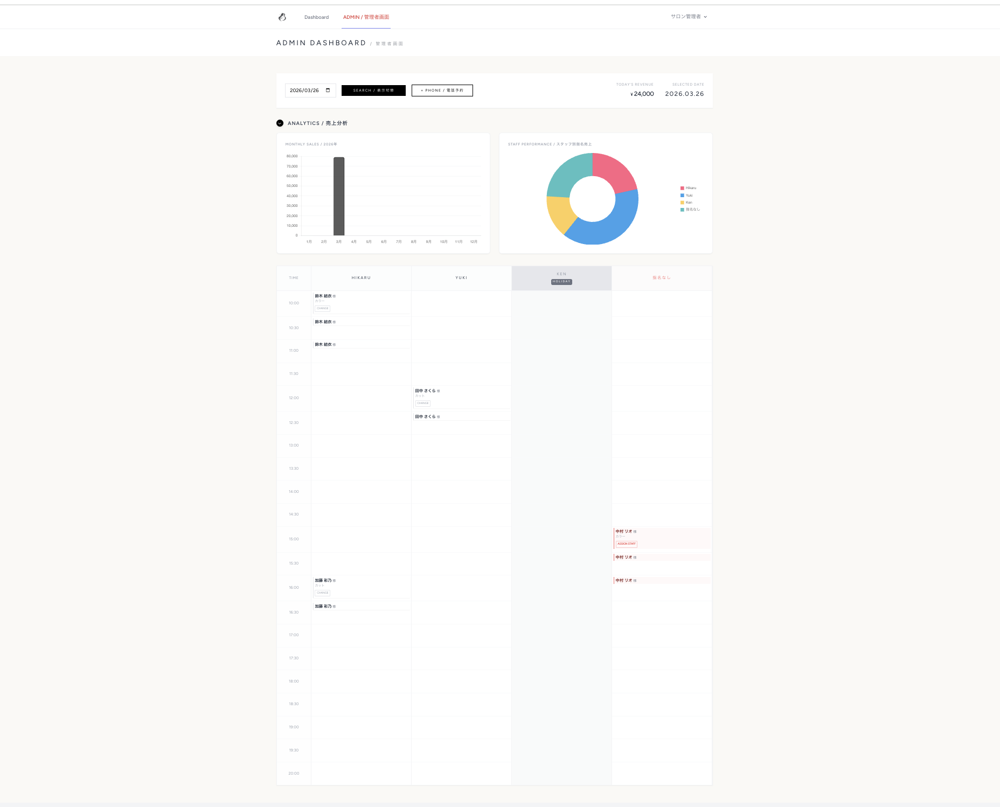

# Beauty System (ハイエンドサロン向け 独立型予約・業務管理システム)

**高額な外部ポータルサイトへの依存から脱却し、利益率の改善とリピーターの囲い込みを実現する自社導入型の予約管理プラットフォームです。**

洗練された顧客体験(UX)と、美容室のリアルな経営課題の解決を両立する設計にこだわりました。

---

## デモアクセス（採用ご担当者様へ）

ワンクリックでログイン可能なデモ機能を実装しております。スムーズなUI/UXおよび管理者機能をご体験ください。

**[アプリURLはこちら](https://beauty-salon-system-5e46f31a3e68.herokuapp.com)**

**【体験の手順】**

1. トップページより「Book Now / オンライン予約」をクリック
2. ゲート画面にて「Login / 会員の方」を選択
3. ログイン画面下部の「デモ体験」エリアより、以下のいずれかのボタンをクリックしてください。
    - **一般のお客様（デモ）:** ユーザー視点での予約フローをご体験いただけます。
    - **サロン管理者（デモ）:** 予約タイムライン確認、スタッフ割り当て、売上ダッシュボード等をご確認いただけます。

> **【運用に関する補足】**
> 自由にデータの追加・更新・削除をお試しください。実際のWebサービス運用を想定し、デモユーザーのデータは**毎日深夜0時に自動リセット（Seederの再実行）**される設計としております。

---

## 導入による想定成果（ビジネスインパクト）

本システムは、Instagram等のSNSから直接予約へ繋ぎ、新規集客とリピーターの囲い込みを両立する運用を想定しています。

- **利益率の大幅な改善:** SNS経由の予約を自社システムで直接受けることで、高額な外部プラットフォームの手数料を削減。
- **機会損失の確実な防止:** 厳密なキャンセル期限（前日23:59まで）をサーバーサイドで制御し、直前のドタキャンを未然に防ぎます。
- **失客率の低下:** 画面を切り替えずにリアルタイムで空き状況がわかるUIで、「予約しようとしたが埋まっていた」というストレスによる顧客離脱を防ぎます。

---

## 開発背景：「友人の開業」から見えたリアルな葛藤

**ターゲットユーザー:** スタッフ 3〜5名規模の独立系ハイエンドサロン

友人が美容室を開業する中で、「予約管理や集客を外部サービスに依存せざるを得ず、毎月の手数料が経営の重荷になっている」というリアルな悩みを聞いたことが開発のきっかけです。
「現場でも無理なく使えて、かつ外部依存から少しでも抜け出せる仕組みを技術で提供できないか？」と考え、実際に現場の業務フローをヒアリング・整理した上で本システムを設計しました。

---

## こだわりの設計（技術的アプローチ）

単なるCRUDアプリにとどまらず、実際の店舗運用に耐えうる複雑な予約ロジックと、堅牢なバックエンド実装にこだわりました。

### 1. 現場の運用ルールを完全再現した「裏側処理」

「指名なし予約」に対し、お客様には「指名なし」として見せつつ、管理者側では特定スタッフを割り当て、売上集計上は「フリー客」として処理する等、美容室特有の複雑なビジネスルールをシステムに落とし込みました。

### 2. 動的なタイムライン生成と排他制御（ダブルブッキング防止）

- **コマ数自動計算:** ユーザーが選択した複数メニューの「合計所要時間」を算出し、30分単位で必要な枠を自動計算。
- **トランザクションと排他制御:** 予約確定時のダブルブッキングを防ぐため、満席チェックから保存までのトランザクション処理を実装。MySQL(JawsDB)環境において確実な予約処理を担保しています。

### 3. 不要な情報を削ぎ落としたUI設計

Instagram等から流入したお客様が直感的に予約を完了できるよう、ページ遷移を極限まで削減。ハイエンドサロンにふさわしい「余白を活かした引き算のデザイン」で入力ストレスを排除しました。

---

## 使用技術

- **Laravel 11:** 複雑な予約ルールやビジネスロジックを、安全かつ正確に処理するため。
- **MySQL (JawsDB):** 本番環境での排他制御とデータ整合性を担保するため。
- **Tailwind CSS / Alpine.js:** 洗練されたデザインと、非同期なUI操作（モーダル開閉やタブ切替）を実現するため。
- **Chart.js:** 直感的な管理者ダッシュボードで「月別売上」や「スタッフ別売上」を可視化するため。

---

**【今後の統合ビジョン】**
現在は予約・業務管理に特化していますが、別途開発済みの「資材購買ダッシュボード（SCM Insight）」で培った知見を活かし、シャンプーやカラー剤などの「在庫・発注管理機能」を統合予定です。
発注から検収、そして予約実績と連動した在庫の自動消費までを一気通貫でDX化できる、包括的なサロンマネジメント・プロダクトへと進化させていきます。
