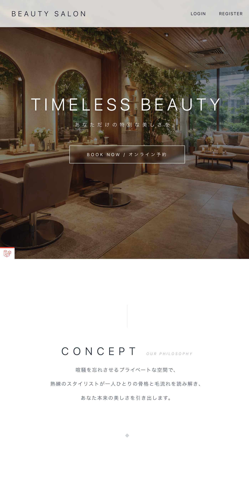
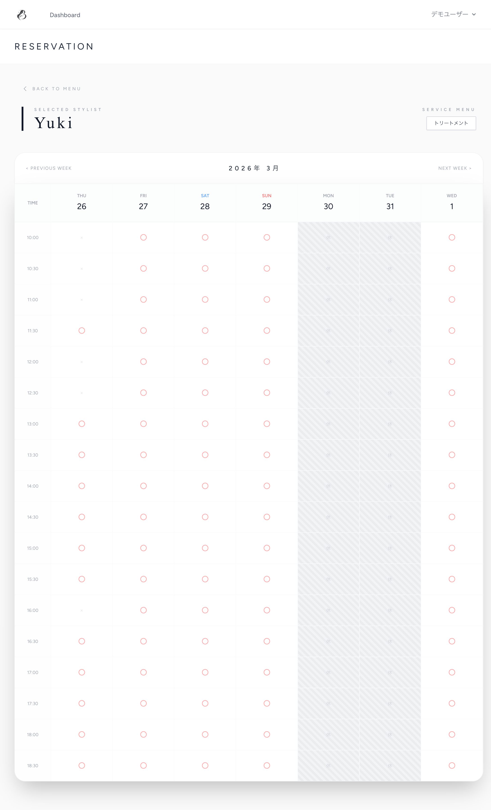

＃beauty_system

洗練された顧客体験と、美容室のリアルな業務課題の解決を両立する予約・業務管理システムです。

## デモ(Demo)

採用ご担当者様は、以下のテスト用アカウントにて実際の動作をご確認いただけます。

- **URL:** `[ここにデプロイ後のURLを記載]`
- **テスト用メールアドレス:** `test@example.com`
- **パスワード:** `password123`

## 制作背景・コンセプト

前職での業務経験から、「ドタキャンによる機会損失」や「売上の属人化」といった現場のリアルな課題を実感していました。
そのため本システムでは、お客様が直感的に操作できる「余白を活かした引き算のデザイン」を実現するだけでなく、**店舗運営の課題解決まで踏み込んだ設計**を意識して開発しました。

## アピールポイントと想定効果

### 1. 店舗の機会損失を防ぐ「厳密なキャンセル制御」

- **実装の工夫（サーバー側での制御）:** キャンセル期限（前日23:59）をサーバー側でCarbonを用いて厳密にチェックしています。フロント側（ボタンの非表示）だけの制御に依存せず、APIを直接叩くような不正なアクセスにも耐えうる設計としました。
- **導入のメリット:** ドタキャンを未然に防ぎ、空き枠への新規予約や電話対応を促すことで、店舗側の機会損失を削減します。

### 2. Ajaxを活用した「リアルタイムな空き状況チェック」

- **実装の工夫（非同期通信）:** カレンダー表示にAjax（非同期通信）を用い、スタッフごとの1週間の空き状況を、画面遷移なしで即座に判定・表示できるようにしました。
- **導入のメリット:** 「予約しようとしたら埋まっていた」というストレスをなくし、お客様の離脱を防ぐことで、顧客体験（UX）を向上させます。

### 3. Alpine.jsとTailwind CSSによる「高級感と快適な操作性の両立」

- **技術選定の理由:** 予約画面のリッチなUI切り替えやモーダル制御には、軽量なAlpine.jsを採用。JavaScriptファイルを必要最低限に抑え、保守性を高めています。
- **導入のメリット:** 「白・チャコールグレー」を基調とした洗練されたデザインと、ストレスのないスムーズな操作性により、ハイエンドサロンにふさわしいホスピタリティを体現しています。

### 4. 現場のリアルな運用ルールを完全再現した「予約ロジック」

- **実装の工夫（ビジネスルールへの対応）:** 美容室特有の複雑な要件をコードに落とし込んでいます。
    - **予約枠の自動制限:** オーバーブッキング防止のため、同じ時間帯の予約を「最大4名まで」に自動で制限。
    - **定休日の自動ブロック:** スタッフごとの休日データをカレンダーに動的に反映し、予約不可に設定。
    - **「指名なし」のスマートな裏側処理:** 「指名なし」の予約に対し管理者側でスタッフを割り当てても、顧客側には「指名なし」として見せ続け、売上集計上も「指名なし」として処理するロジックを設計。
- **導入のメリット:** スタッフが「頭の中で考えていたルール」をシステムが自動で制御するため、ヒューマンエラーを防ぎ、業務負担を大幅に軽減します。

### 5. 直感的な管理者ダッシュボード (Chart.js)

- **実装の工夫（データの可視化）:** 管理者画面では、Chart.jsを用いて「月別売上」や「スタッフ別売上」を可視化。Laravelの `@json` ディレクティブを活用し、PHPのデータをスムーズにJavaScriptへ渡せるよう設計しました。
- **導入のメリット:** 売上データの可視化により、店舗の現状把握と戦略的なスタッフ配置をサポートします。

## 使用技術

**Backend**

- PHP 8.x
- Laravel 11.x
- MySQL

**Frontend**

- Tailwind CSS
- Alpine.js
- Chart.js
- JavaScript (ES6+ / Viteによるモジュール管理)

**Infrastructure / Others**

- (※デプロイしたらここにHerokunなどをかく)
- GitHub

##　 画面構成・機能一覧

### ユーザー（お客様）画面

- **予約一覧（ダッシュボード）:** 予約状況の確認、期限内のキャンセル機能、サロンからのお知らせ表示。
- **新規予約:** メニュー選択 → スタッフ選択 → 日時選択（非同期カレンダー）。
- **履歴確認:** 過去の来店履歴と利用金額の確認。

### 管理者（店舗スタッフ）画面

- **ダッシュボード:** 本日の売上、チャートによる売上分析。
- **タイムライン表示:** スタッフごとの予約状況を時間枠で一覧表示。
- **予約管理:** 電話予約の手動登録、担当スタッフの変更、予約のキャンセル処理。

## 今後の展望

今後は、資材調達部門で10年間培ってきた経験を活かし、美容室のシャンプーやカラー剤などの「在庫・発注管理機能」を統合したシステムへと拡張していく構想を持っています。
